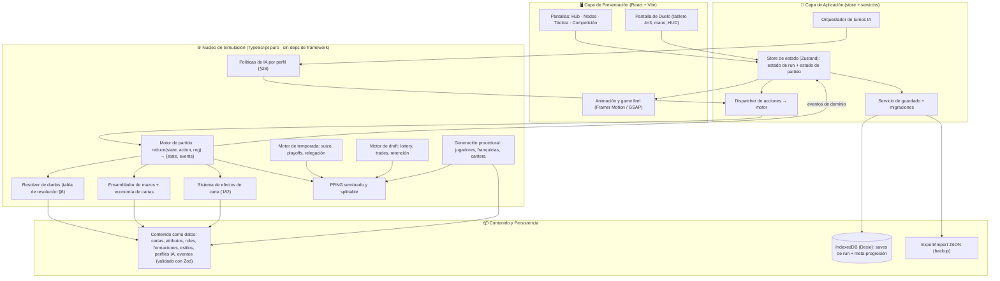
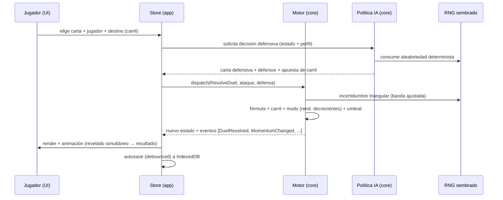
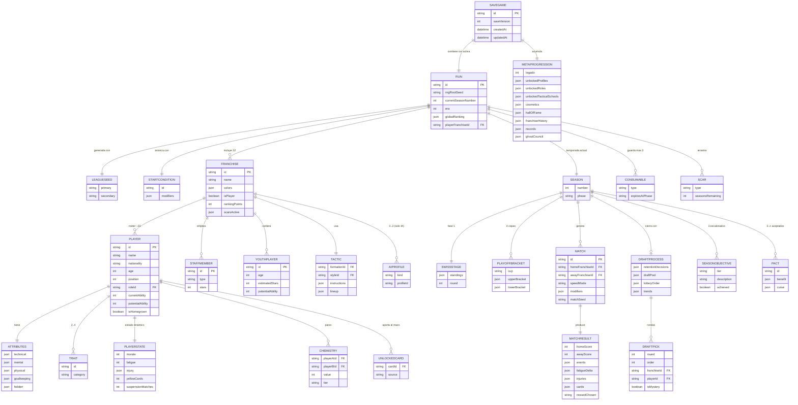

# Football RPG — PRD + Arquitectura Completa (`FULL_ARCHITECTURE`)

> **Documento vivo · v0.1** · Deliverable de ingeniería para arrancar la implementación.
> **Contexto real del proyecto (leer antes que nada):** web app de uso personal, un roguelite de fútbol por cartas contra IA. Equipo: **1 desarrollador + IA**. Stack objetivo: **ecosistema JavaScript/TypeScript**. Este documento está *deliberadamente right-sized*: donde una plantilla enterprise pediría SLA de millones de usuarios, threat modeling de PCI-DSS o Kubernetes, aquí se explica por qué **no aplican** y qué es lo que sí importa de verdad (determinismo, integridad de partidas guardadas, testabilidad del motor, y una arquitectura que la IA pueda ayudarte a construir sin romperse). Un arquitecto senior no cargo-cultea secciones: las adapta a la realidad del proyecto.

---

## Tabla de contenidos

1. [Executive Summary](#1-executive-summary)
2. [Contexto y oportunidad](#2-contexto-y-oportunidad)
3. [Objetivos y no-objetivos](#3-objetivos-y-no-objetivos)
4. [Requerimientos funcionales](#4-requerimientos-funcionales)
5. [Requerimientos no funcionales](#5-requerimientos-no-funcionales)
6. [Diseño de experiencia y dirección visual (consejo de diseño)](#6-diseño-de-experiencia-y-dirección-visual)
7. [Arquitectura técnica de alto nivel (System Design)](#7-arquitectura-técnica-de-alto-nivel)
8. [Architecture Decision Records (ADRs)](#8-architecture-decision-records-adrs)
9. [Tech Stack — selección y justificación](#9-tech-stack)
10. [Modelo de datos (ER + narrativa)](#10-modelo-de-datos)
11. [Contratos internos ("API" del motor) y esquema de contenido](#11-contratos-internos-api-del-motor)
12. [Seguridad e integridad de datos](#12-seguridad-e-integridad-de-datos)
13. [Rendimiento y escalabilidad](#13-rendimiento-y-escalabilidad)
14. [Estudio de viabilidad técnica](#14-estudio-de-viabilidad-técnica)
15. [Plan de implementación (fases para 1 dev + IA)](#15-plan-de-implementación)
16. [Riesgos y mitigaciones](#16-riesgos-y-mitigaciones)
17. [Glosario y referencias](#17-glosario-y-referencias)

---

## 1. Executive Summary

**Visión en una frase.** Un roguelite de fútbol por cartas para un solo jugador donde *tu plantilla es tu mazo*, cada acción del partido se decide en un duelo con revelado simultáneo, y la liga entera es la *run*: sobrevive a la relegación o tu carrera termina.

**El problema / oportunidad.** No es un producto de mercado con métricas de negocio; es un proyecto personal con un objetivo claro y medible: **convertir un manual de reglas extraordinariamente detallado (44 secciones, 182 cartas, ~40 atributos por jugador, un motor de resolución calibrado contra Football Manager, y un envoltorio roguelite completo) en un juego jugable y balanceable, construido por una persona con ayuda de IA.** El reto no es de escala de usuarios: es de **complejidad de dominio**. El valor del documento es reducir esa complejidad a una arquitectura que un solo desarrollador pueda ejecutar sin ahogarse y que la IA pueda asistir de forma fiable.

**Propuesta de valor diferencial (del juego).** Tres puentes que el manual ya define y que la arquitectura debe respetar como invariantes:

- **Puente 1 — La plantilla ES el mazo.** Cada jugador aporta cartas al mazo según sus atributos, rol y rareza. Draftear cambia *cómo juegas*, no solo un número.
- **Puente 2 — El partido se decide en duelos.** Motor por turnos, cadenas de posesión, revelado simultáneo con mind-game de carril. `~64-68` "jugadas" (reloj compartido) por partido.
- **Puente 3 — La liga es la run.** 32 franquicias, formato suizo + playoffs, y permadeath: cada temporada los 6 peores de Copa Bronce que no llegan a la final son relegados. Si estás ahí, fin de la run.

**Criterios de éxito del proyecto (OKR técnico, no de negocio).**

| Objetivo | Resultado clave medible |
|---|---|
| El motor es correcto y determinista | Dada una semilla + un log de acciones, la simulación reproduce **bit a bit** el mismo resultado (100% de replays reproducibles en tests). |
| El juego es balanceable sin jugar a mano | Poder simular **≥10.000 partidos IA-vs-IA headless** en < 60 s para validar tasas de gol/robo/tarjeta contra las tablas del manual. |
| La complejidad no bloquea al dev | Cobertura de tests del **núcleo** ≥ 80 % en líneas y 100 % en la tabla de resolución (sección 6 del manual). |
| El roguelite se siente como roguelite | Una *run* completa (creación → temporada → retención → draft → nueva temporada) jugable de principio a fin en v1. |
| Las partidas sobreviven a la iteración | Todo cambio de esquema de guardado pasa por una **migración versionada**; 0 partidas corruptas irrecuperables en desarrollo. |

---

## 2. Contexto y oportunidad

### 2.1 Análisis del "problema" (pain points reales de este proyecto)

Este no es un análisis de mercado: es un inventario honesto de los riesgos que hacen fracasar proyectos personales de esta ambición.

- **Alcance gigantesco vs. un solo desarrollador.** El manual describe un juego con la profundidad de un Football Manager + un deckbuilder + un roguelite. Sin una arquitectura que permita construir *verticalmente* (una rebanada jugable antes que todo el ancho), el proyecto muere por agotamiento antes de ser jugable.
- **Acoplamiento reglas ↔ UI.** Si la lógica de 182 cartas vive dentro de componentes de interfaz, el juego se vuelve intocable: no se puede testear, no se puede balancear, no se puede simular. Es el error nº1 que hunde estos proyectos.
- **Balance imposible a mano.** Con `~38` puntos de swing por duelo y decenas de modificadores interactuando, ajustar el balance "jugando" es inviable. Hace falta **simulación headless masiva** desde el diseño.
- **Determinismo y bugs de azar.** Un roguelite sin RNG sembrado y reproducible es imposible de depurar ("no consigo reproducir el bug"). Las semillas ya son una mecánica del juego (sección 16): el determinismo no es opcional, es parte del diseño.
- **Persistencia frágil.** Vas a iterar sobre este juego durante meses. Sin versionado de esquema y migraciones, cada cambio te obligará a borrar tu partida. Frustración garantizada.

### 2.2 "Competitive landscape" técnico (referencias de las que copiar patrones)

No como competidores de negocio, sino como **fuentes de patrones de ingeniería** ya resueltos por juegos parecidos:

- **Slay the Spire / roguelites deck-builders:** separación motor puro ↔ render; contenido como datos; RNG sembrado por *run*; mods habilitados por data-driven design. El mapa de nodos entre partidos del manual (sección 35) es literalmente un StS.
- **Football Manager:** modelo de atributos 1-20, CA/PA, coste cuadrático de atributos, atributos ocultos. El manual ya calibra sus probabilidades contra citas de SI Games.
- **Motores de cartas (Hearthstone-like):** el problema del *"efecto de carta"* — cómo representar 182 efectos heterogéneos sin un `switch` de 3.000 líneas. Patrón: sistema de efectos tipados / mini-DSL declarativa.
- **Juegos con replays deterministas (RTS, autobattlers):** estado + log de acciones + RNG sembrado ⇒ replay perfecto. Habilita depuración, "compartir semilla", y validación.

### 2.3 Supuestos y dependencias

- **S1.** Uso personal, un jugador, offline-first. No hay requisito de cuentas, login, ni servidor en la v1. *(Si cambia, ver §13.4 ruta a multijugador.)*
- **S2.** El rival IA es **heurístico/determinista** (perfiles del manual §28 = políticas de decisión ponderadas). **No** se usa un modelo de lenguaje ni ML en tiempo de partido. *(Ver ADR-007.)*
- **S3.** El navegador objetivo es moderno (Chromium/Firefox/Safari recientes), desktop primero, con IndexedDB y ES2022 disponibles.
- **S4.** El manual de Notion es la **fuente de verdad del diseño**; este documento no lo reinventa, lo *implementa*. Los números concretos (potencias, umbrales, probabilidades) se extraen a datos versionados.
- **D1.** Dependemos de librerías open-source maduras (ver §9). Riesgo de *vendel lock-in* mínimo por ser local-first (ver §12).

---

## 3. Objetivos y no-objetivos

### 3.1 Lo que el sistema SÍ hará

**v1 — "La run jugable" (MVP vertical, el corazón).** El objetivo de la v1 no es el ancho del manual, sino una *rebanada vertical* completa que demuestre el bucle:

- Motor de partido completo en **Modo Completo** (duelo por duelo): cadena de ataque, defensa con mind-game de carril, tabla de resolución (§6), momentum unificado con racha integrada (§7), energía/fatiga, remates y portero, balón dividido, prórroga y penaltis.
- Un subconjunto de cartas **suficiente y representativo** (Base + Avanzada de las categorías nucleares: pases, regates, tiros, centros, defensa, portero, instantes, tácticas). Las Élite/técnicas especiales/combinadas pueden llegar en v1.1 sin cambiar la arquitectura.
- Sistema táctico mínimo viable: 3-4 formaciones, 3-4 estilos, roles esenciales por posición.
- Un rival IA funcional con al menos 3-4 perfiles tácticos (§28).
- El bucle roguelite de **una temporada**: creación de franquicia (§37) → nodos entre partidos (§35: recuperación, entrenamiento, evento/actividad, preparación) → fase suiza → playoffs → retención → draft → temporada 2.
- Permadeath y relegación funcionando. Ranking de relegación visible (§33).
- Persistencia local con auto-guardado y export/import de partida.

**v2 — "El roguelite completo".**

- Catálogo completo de 182 cartas, técnicas especiales y combinadas, cartas de rol exclusivas.
- Modos de velocidad **Táctico** y **Resumen** (§2 del manual).
- Semillas de liga (principal + secundaria, §16), condiciones de arranque (§32), consumibles, picks misteriosos, cicatrices, hitos, pactos de temporada, desafíos de partido.
- Meta-progresión: Legado, perfiles de inicio, desbloqueos, Libro de la Liga (§27).
- Sistema completo de química (§19), moral y vestuario (§20), cantera (§21), staff (§22), desarrollo y árboles por rol (§17/§17b), eventos de carrera (§26), autopsia post-muerte (§39), estrella rival/mini-boss (§40).
- Escalada por eras (§16), tendencias del draft (§23), rareza visual (§41), sinergias emergentes (§42).

**v3 — "Pulido y vida útil".**

- Balance afinado con datos de simulación masiva.
- Accesibilidad, animaciones de "drama de duelo" estilo Captain Tsubasa, sonido.
- Herramientas de creador: editor de contenido (cartas/atributos como datos), modo debug/replay, panel de telemetría de balance.
- (Opcional) Sync de partidas entre dispositivos.

### 3.2 Lo que el sistema NO hará (con justificación)

| No-objetivo | Justificación |
|---|---|
| **Multijugador online / PvP en v1-v2** | El diseño es explícitamente "contra IA". El multijugador multiplica por 5 la complejidad (servidor autoritativo, anti-cheat, matchmaking, netcode). El motor determinista deja la puerta abierta a futuro (§13.4) sin pagar el coste ahora. |
| **Backend / servidor para v1** | Todo es simulación local. Un servidor solo añadiría coste operativo y superficie de fallo sin aportar nada a un juego de un jugador offline. |
| **Cuentas de usuario, login, OAuth** | Uso personal. La "identidad" es el propio dispositivo/navegador. Innecesario y contraproducente. |
| **IA basada en LLM/ML para el rival** | Los perfiles del manual son heurísticas deterministas perfectamente codificables. Un LLM sería no determinista (rompe replays), caro, lento, y con dependencia de red. *(Ver ADR-007.)* |
| **Next.js / SSR / app router** | Es un SPA de cliente pesado con estado de juego. SSR no aporta nada (no hay SEO que importe, no hay contenido servidor) y añade complejidad de servidor. *(Ver ADR-002.)* |
| **Motor de físicas / 3D / render de campo realista** | El juego es táctico y abstracto (franjas/carriles, cartas). Un motor 2.5D abstracto y animaciones de UI bastan y sobran. |
| **Monetización, ads, analytics de terceros** | Proyecto personal. Cero. |
| **Escalabilidad horizontal, microservicios, orquestación** | No hay servidor que escalar. La única "escala" relevante es el rendimiento del motor en un hilo (§13). |

### 3.3 Criterios de salida de cada fase ("definition of done" de fase)

- **v1 done:** puedo crear una franquicia, jugar una temporada completa duelo a duelo contra la IA, ser relegado o sobrevivir, y empezar una segunda temporada tras retención + draft, todo con partida guardada que sobrevive a recargar la página. El motor pasa los tests de la tabla de resolución.
- **v2 done:** el catálogo completo y todos los sistemas de meta-progresión están implementados; puedo hacer *runs* de varias temporadas con semillas, consumibles, cicatrices y Legado persistente entre runs.
- **v3 done:** balance validado por simulación (tasas dentro de los rangos del manual), experiencia pulida y herramientas de creador operativas.

---

## 4. Requerimientos funcionales

### 4.1 User stories nucleares (Given/When/Then con criterios binarios)

> Formato: cada criterio de aceptación es verificable (verdadero/falso). Prefijo `RF-`.

**RF-01 — Resolver un duelo.**
*Como* jugador, *cuando* elijo carta + jugador + destino (carril incluido) y la IA elige carta defensiva + defensor + apuesta de carril, *entonces* el sistema revela simultáneamente y resuelve según la fórmula `Fuerza_ataque − Fuerza_defensa + Incertidumbre`.
- ✅ La influencia de atributo se comprime a la escala `-4..+4` (tabla §6 del manual).
- ✅ Los modificadores situacionales aplican con rendimientos decrecientes (100%/50%/33%).
- ✅ El acierto/fallo de carril aplica íntegro (`+2 / −1`), sin entrar en el tope de modificadores.
- ✅ La banda de incertidumbre es triangular `-6..+6`, ajustada por Composure y banda dinámica (mínimo `±3`).
- ✅ El resultado cae en el umbral correcto de la tabla (Éxito aplastante … Contragolpe devastador) y aplica sus efectos (avance, robo, momentum, presión acumulada).
- ✅ El duelo consume exactamente **1 jugada del reloj** (salvo excepciones tabuladas: córner 2, penalti 2, posesión estéril 2, etc.).

**RF-02 — Gestionar el reloj del partido.**
*Como* motor, *cuando* transcurre el partido, *entonces* consumo del reloj compartido según la tabla de consumo (§2) y calculo el descuento variable (`+0.5` por falta, `+1` por lesión, `+0.5` por cambio).
- ✅ Primera parte = 30 jugadas, segunda = 30, descuento = 4-8 (semioculto: se muestra rango, se revela con 2 jugadas restantes).
- ✅ No hay empates: prórroga (10+10) y penaltis si persiste.
- ✅ Regla del "último suspiro" para el equipo que pierde con reloj a 0.

**RF-03 — Construir el mazo desde la plantilla.**
*Como* motor, *cuando* comienza un partido, *entonces* ensamblo los tres sub-mazos (ataque `~18-20`, defensa `~10-12`, compartido `~6-8`) a partir de las cartas que aporta cada jugador titular según atributos, rol y rareza.
- ✅ Se respeta el suelo mínimo (14 ataque / 8 defensa) rellenando con cartas genéricas si la plantilla no aporta suficientes.
- ✅ El set del portero es independiente y se regenera entre posesiones.
- ✅ Robo correcto por fase (2 de la fase + 1 del compartido) y mano máxima 7.

**RF-04 — Rival IA por perfil.**
*Como* jugador, *cuando* enfrento a una franquicia IA, *entonces* la IA toma decisiones (draft, formación, cartas en duelo) coherentes con sus 3 perfiles (táctico/gestión/personalidad, §28).
- ✅ La IA elige cartas y apuestas de carril con una política determinista dada la semilla.
- ✅ Los perfiles modifican mensurablemente el comportamiento (p.ej. "Muralla" produce más partidos 0-0/1-0 que "Blitzkrieg").
- ✅ Némesis (máx 1) y Dinastía (máx 1-2) se asignan respetando las restricciones.

**RF-05 — El bucle de temporada.**
*Como* jugador, *cuando* avanzo la temporada, *entonces* recorro: nodos entre partidos (§35) → fase suiza (5 victorias = Championship / 5 derrotas = eliminado) → clasificación en 4 copas → playoffs (doble eliminación con lower bracket) → final → retención (elijo 15, los jugadores pueden rechazar) → promoción de canteranos → pre-draft (trades) → lottery pick → draft → nueva temporada.
- ✅ La relegación se evalúa cada temporada; permadeath si estoy entre los 6 peores de Copa Bronce sin llegar a la final.
- ✅ El ranking global determina orden de draft, retención y efectos de gestión.

**RF-06 — Nodos entre partidos.**
*Como* jugador, *cuando* estoy entre dos partidos, *entonces* recorro 4 nodos en orden: Recuperación (informativo) → Entrenamiento (elijo 1 enfoque grupal + 1 foco individual) → Evento/Actividad (40% evento catálogo / 35% actividad / 25% semana tranquila) → Preparación (alineación, formación, estilo, ojeo del rival).
- ✅ El entrenamiento sube atributos con barras 0-100% visibles; el grupo elegido progresa 100%, el resto 25%.
- ✅ Alcanzar 100% en una barra sube el atributo +1 y puede desbloquear cartas nuevas.

**RF-07 — Persistencia de la run.**
*Como* jugador, *cuando* cierro y reabro la app, *entonces* mi *run* continúa exactamente donde la dejé.
- ✅ Auto-guardado tras cada acción significativa (fin de duelo, fin de nodo, fin de partido).
- ✅ Export/import de partida a fichero JSON.
- ✅ Al cargar una partida de una versión anterior del juego, se aplican migraciones y la partida sigue siendo jugable.

**RF-08 — Meta-progresión (v2).**
*Como* jugador, *cuando* termina una run, *entonces* gano Legado según logros y puedo gastarlo en desbloqueos permanentes (perfiles de inicio, roles, escuelas tácticas, cosméticos) que abren *opciones*, no *poder*.
- ✅ El Legado y los desbloqueos persisten entre runs en un almacén separado del estado de run.
- ✅ El Libro de la Liga acumula Salón de la Fama, historial de franquicias, récords y consejos post-muerte.

### 4.2 Casos de uso críticos (flujo principal + alternativos)

**CU-01 · Jugar un partido (Modo Completo).**
*Flujo principal:* preparación → inicio de parte → bucle de posesiones (robo → duelos en cadena → progresión/pérdida/remate) → descanso (ajustes) → segunda parte → descuento → fin → (prórroga/penaltis si empate) → recompensa post-partido.
*Alternativos:* pérdida de balón → inversión de roles y transición; balón dividido (0) → mini-duelo forzar/ceder; falta → tarjeta/tiro libre y `+0.5` descuento; lesión → jugador fuera + `+1` descuento; reloj a 0 en posesión → completar duelo/último suspiro; agotamiento de sub-mazo → jugadas improvisadas (potencia 0) o reconversión de carta.

**CU-02 · Draft de fin de temporada.**
*Flujo principal:* retención (15, con indicadores de intención desde media temporada) → promoción de canteranos → formación de la bolsa → pre-draft (trades IA↔jugador) → lottery pick (bolas para picks 1-4, orden fijo del 5º en adelante) → rondas de draft hasta completar 23 → validación de normas (3 porteros, 4 canteranos).
*Alternativos:* jugador rechaza retención (coste: pierde química, historial canterano, `-2..-5` PA); pick misterioso (atributos ocultos, ~40% bueno); normas incumplidas (penalización: plantilla incompleta + baja 4 puestos en el próximo draft por hueco de canterano); tendencia del draft que sesga el pool.

**CU-03 · Crear una nueva franquicia / iniciar run.**
*Flujo:* revelar semilla principal + secundaria → condición de arranque (no rechazable) → (opcional) gastar Legado en perfil de inicio y/o desafío → generación procedural (nombre, colores, 23 jugadores, staff, cantera, 31 rivales) → presentación → elección de formación/estilo/roles → arranque directo en temporada 1 (la primera run es el tutorial).

### 4.3 Reglas de negocio explícitas (lógica condicional documentada)

Estas son *invariantes del dominio* que el motor debe garantizar. Cada una es candidata a test unitario:

- **RN-01 (topes de bonus):** ningún duelo acumula más de `+5` de bonus por modificadores externos (estilo + rol + química + condiciones + …). El exceso se ignora. El bonus de transición también se capea a `+5`. **El momentum tiene su propio cap duro de ±0.75** (+0.15/punto, ver RN-04), que se aplica antes de entrar en el bruto acumulado; no cuenta contra el tope de +5 genérico.
- **RN-02 (potencia íntegra):** la potencia de la carta, la influencia del atributo y el carril **no** entran en rendimientos decrecientes; se aplican íntegros. Todo lo demás (momentum, First Touch, estilo, rol, química, presión, condiciones) sí.
- **RN-03 (fase de carta):** una carta se juega en su fase natural (A/D/A-D/I/P). Fuera de fase: improvisada (potencia 0, no gasta carta) o reconvertida (potencia mitad redondeada abajo, gasta carta). El portero improvisado sólo tiene Parada básica.
- **RN-04 (momentum unificado, §7):** barra fraccional `-5..+5` en pasos de `0.5`. Efecto continuo: `+0.15` de Fuerza por punto, **cap duro `±0.75`** (se aplica antes de rendimientos decrecientes). Se mueve por dos tablas excluyentes: eventos significativos (goles, paradas, robos, racha de posesión, paradón estándar) y resultados de duelo (duelos ganados consecutivos `+0.5`, pérdidas `-1` a `-2`; tramo más específico, no acumulan). Bonus por umbrales (one-shot, capa de cartas): `+3` → +1 potencia; `+4` → robar 1 carta; `+5` → jugador "en la zona" (+1 influencia individual, sobrevive al descenso) + carta Jugada perfecta. Degradación asimétrica: positivo `-1` sin evento ni duelo ganado; negativo `-1` cada posesión; Determination 16+ acelera. Se registra el máximo alcanzado para bonus post-partido.
- **RN-05 (fatiga individual):** sólo suma cuando el humano **elige activamente** al jugador del pool (aparecer sin ser elegido no fatiga). Umbral = Stamina ajustada; superar el umbral resta `-1` a todos los atributos por cada 2 de exceso.
- **RN-06 (tarjetas):** 5 amarillas acumuladas = 1 partido de suspensión (se resetea el contador tras cumplirla). Roja directa = 2-3 partidos sin resetear amarillas.
- **RN-07 (normas de plantilla):** exactamente 23 jugadores, ≥3 porteros, ≥4 canteranos. Incumplir en draft ⇒ plantilla incompleta + penalización de posición de draft.
- **RN-08 (permadeath):** al final de cada temporada, los 6 de Copa Bronce que no alcanzan la final son relegados; si es la franquicia del jugador, la run termina.
- **RN-09 (incompatibilidades de estilo):** Posesión ✗ Pressing alto; Contragolpe ✗ Tempo bajo; Pressing alto ✗ Línea baja; Catenaccio ✗ Línea alta (lista completa en §9/§catálogo del manual). El motor rechaza combinaciones inválidas.
- **RN-10 (determinismo):** toda aleatoriedad pasa por el PRNG sembrado de la run. Ninguna llamada a `Math.random()` en el núcleo. *(Invariante arquitectónico, verificable por lint.)*

### 4.4 Matriz de priorización (MoSCoW)

| Prioridad | Elementos | Justificación |
|---|---|---|
| **Must (v1)** | Motor de duelo + tabla de resolución (RF-01), reloj (RF-02), ensamblado de mazo (RF-03), IA básica (RF-04), bucle de 1 temporada (RF-05), nodos (RF-06), persistencia + migraciones (RF-07), PRNG sembrado (RN-10), permadeath (RN-08). | Sin esto no hay *juego*. Es la rebanada vertical mínima que prueba los tres puentes. |
| **Should (v1.1-v2)** | Catálogo completo de 182 cartas, técnicas especiales/combinadas, modos Táctico/Resumen, química (§19), draft con lottery + trades + picks misteriosos, semillas de liga, consumibles, cicatrices. | Convierte el MVP en "el juego". Alto valor, pero la arquitectura ya los soporta sin rediseño. |
| **Could (v2-v3)** | Meta-progresión completa (Legado, desbloqueos, Libro de la Liga), eventos de carrera (§26), pactos, desafíos, eras, estrella rival, autopsia post-muerte, rareza visual, sinergias emergentes. | Profundidad y rejugabilidad. Incrementales sobre bases sólidas. |
| **Won't (por ahora)** | Multijugador, backend, cuentas, IA con LLM, 3D, monetización. | Fuera del alcance del proyecto personal (ver §3.2). |

---

## 5. Requerimientos no funcionales

> **Nota de right-sizing:** un PRD enterprise pondría aquí SLA de 99.99%, RTO/RPO, RPS y cumplimiento PCI-DSS/GDPR. Para una app local de un jugador **nada de eso aplica**: no hay servidor que caiga, no hay datos de terceros, no hay tráfico. Lo que sí importa se reformula abajo. Ser honesto aquí es parte de la calidad del documento.

### 5.1 Rendimiento (lo que de verdad importa aquí)

| Métrica | Objetivo | Por qué |
|---|---|---|
| Resolución de 1 duelo (motor puro) | < 1 ms (p99) | El motor debe ser instantáneo; la sensación de "drama" la da la animación, no el cómputo. |
| Simulación headless de 1 partido completo (sin render) | < 5 ms (p50), < 15 ms (p99) | Habilita balance por simulación masiva. |
| Batch de balance | ≥ 10.000 partidos IA-vs-IA en < 60 s en un portátil | Validar tasas de gol/robo/tarjeta contra el manual sin jugar a mano. |
| Tiempo de carga inicial de la app | < 2 s en desktop moderno | SPA con code-splitting; el contenido (cartas/atributos) se carga como datos. |
| Frame budget de animación de duelo | 60 fps | El "drama Captain Tsubasa" no puede tironear. Animaciones en la capa de UI, nunca bloqueando el motor. |
| Guardado (write a IndexedDB) | < 50 ms, no bloqueante de UI | Auto-save frecuente sin *jank*. |

### 5.2 Disponibilidad y recuperación (reinterpretado como *integridad de partida*)

- **No hay SLA de servidor** (no hay servidor). La "disponibilidad" es que la app funcione offline: **PWA instalable** con service worker cacheando el bundle (v2+).
- **RPO efectivo ≈ 1 acción:** auto-guardado tras cada acción significativa ⇒ como mucho pierdes el último duelo si el navegador crashea.
- **Estrategia de "disaster recovery" (a escala personal):** export automático periódico de la partida a fichero (descarga) + guardado de rotación (mantener las últimas N partidas) para poder volver atrás si una migración sale mal. **Doble buffer de guardado** (escribir en slot B, verificar, promover) para evitar corromper el único save.

### 5.3 Escalabilidad (reinterpretada como *escala de contenido y de cómputo*)

- **Diseño para 32 franquicias × 23 jugadores × ~40 atributos + estado de química (pares) + historiales.** Orden de magnitud: `~736` jugadores activos, `~O(n²)` pares de química por plantilla (`23²≈529` por franquicia, pero sólo importan los pares intra-plantilla ⇒ manejable). Todo cabe holgadamente en memoria y en IndexedDB.
- **Proyección a 3 años (de *contenido*, no de usuarios):** el catálogo puede crecer de 182 a varios cientos de cartas y decenas de eventos/perfiles sin tocar el motor, porque el contenido es **data-driven** (§11). El límite de diseño es la RAM del navegador (varios cientos de MB disponibles), muy lejos de alcanzarse.

### 5.4 Seguridad y clasificación de datos

- **Clasificación de datos:** todo es local y no sensible (estado de un juego). Sin PII, sin secretos, sin datos regulados. **GDPR/PCI-DSS/SOC2 no aplican** en v1 (no se recopila ni transmite nada). Ver §12 para lo que sí importa (integridad y anti-corrupción del save; el "anti-cheat" es irrelevante en single-player — que el jugador edite su propia partida no es una amenaza).

### 5.5 Observabilidad (a escala personal)

- **Logs de desarrollo:** el motor emite un stream tipado de **eventos de dominio** (goles, robos, tarjetas, cambios de momentum…) que alimenta tanto la UI como un log de depuración y las estadísticas de balance.
- **Modo replay/debug:** poder cargar `semilla + log de acciones` y reproducir un partido paso a paso es la herramienta de observabilidad nº1.
- **Panel de telemetría de balance (v3):** histogramas de resultados de duelo, tasas por tipo de carta, distribución de goles por partido — generados desde las simulaciones headless.

### 5.6 Mantenibilidad

- **Cobertura de tests:** núcleo del motor ≥ 80% líneas; 100% en la tabla de resolución y en las reglas de negocio RN-01..RN-10; property-based tests para invariantes (p.ej. "el reloj nunca es negativo", "el momentum nunca sale de `-5..+5`").
- **Contenido validado por esquema:** todo dato de carta/atributo/rol/perfil validado con Zod al cargar; un dato malformado falla ruidosamente en desarrollo, no silenciosamente en runtime.
- **Documentación:** este PRD + un `ARCHITECTURE.md` corto en el repo + tipos como documentación viva. Cada carta lleva su referencia al manual (`sourceRef`).
- **Política de revisión (dev solo + IA):** ver §9.4 — convenciones específicas para que la IA sea un multiplicador y no una fuente de deuda.

---

## 6. Diseño de experiencia y dirección visual

> Esta sección responde directamente a tu petición de consejo de diseño. El manual ya trae una dirección de UI muy fuerte (§33 Interfaz Roguelite, §35 Nodos, §2 Modos de velocidad); aquí la sintetizo y la elevo a **principios de diseño accionables**, con recomendaciones concretas de arte, *feel* y estructura de pantallas.

### 6.1 Los tres registros emocionales que la interfaz debe orquestar

El juego vive en tres tempos radicalmente distintos. El error de diseño más probable es tratarlos con la misma piel. Cada uno pide su propio lenguaje visual:

1. **El duelo (segundos, tensión máxima, "Captain Tsubasa").** Aquí manda el *drama*. Revelado simultáneo, escalada de riesgo, el momento en que dos cartas chocan. Debe sentirse cinematográfico: cámara que se acerca, cartas que se enfrentan en el centro, el número final que "cae" con peso. Es el corazón sensorial del juego.
2. **La gestión entre partidos (minutos, deliberación, "Slay the Spire + Football Manager").** Aquí manda la *legibilidad y la decisión*. Nodos claros, trade-offs explícitos, barras de progreso, indicadores de intención. Calma con textura de estrategia.
3. **La run / meta (horas, tensión de fondo, "roguelite").** Aquí manda la *presión de muerte persistente*. El ranking de relegación y el panel de recursos (§33) siempre presentes, cambiando de color según cuán cerca está el abismo.

**Principio rector:** *un ritmo, una piel.* No uses la misma densidad visual para el duelo (mínima, focal) que para la gestión (densa, informativa).

### 6.2 Dirección de arte recomendada

El manual cita **Nutmeg!** como inspiración estética y **cartas** como metáfora central. Mi recomendación:

- **Estética "baraja de fútbol con carácter", no simulación realista.** Nada de césped fotorrealista ni jugadores 3D. Piensa en **ilustración plana con personalidad**, cromos, tipografía fuerte, y una paleta con identidad (el nombre candidato *Órdago* / *Once de Bastos* apunta a un guiño a la **baraja española** — explótalo: palos, oros/bastos, tipografía de naipe). Esto es una ventaja competitiva de *feel* y además es **barato de producir para un solo dev** (ilustración vectorial/plana escala mejor que arte realista).
- **El campo como abstracción táctica.** Franjas (Defensa/Medio/Ataque/Área) × carriles (izq/centro/der) = una rejilla 4×3. Represéntala como un **tablero estilizado**, no como un estadio. El balón se mueve por celdas. Esto es legible, rendereable con SVG/CSS, y *coherente con las reglas* (que ya piensan en franjas y carriles).
- **Las cartas son ciudadanas de primera clase.** Cada carta necesita un anatomía visual clara: nombre, potencia, atributo clave, fase (color-codificada A/D/A-D/I/P), rareza (Base/Avanzada/Élite con el sistema de rareza visual de §41), coste de energía, restricción, efecto. Diseña **un componente de carta** parametrizado por datos; con 182 cartas, la carta *es* el sistema de diseño.
- **Color como lenguaje funcional, no decorativo.** Reserva colores para significado: fase de carta, nivel de química (gris→dorado, §19), zona de peligro de relegación (verde→rojo, §33), momentum (barra bipolar). El jugador debe *leer el estado* por color antes que por texto.

### 6.3 Mapa de pantallas (arquitectura de información)

```
Pantalla principal (hub de la run)
├── Panel de recursos roguelite (siempre visible): ranking/relegación, consumibles, cicatrices, Legado, semilla, temporada/evaluación
├── Nodo actual (Recuperación / Entrenamiento / Evento / Preparación)
├── Plantilla (jugadores, atributos, roles, química, moral, fatiga, lesiones)
├── Táctica (formación, estilo, instrucciones, roles, mazo resultante)
├── Competición (bracket suizo, playoffs, ranking global, calendario)
└── Partido (pantalla de duelo a pantalla completa)

Pantalla de partido (Modo Completo)
├── Tablero 4×3 (franjas × carriles) con el balón y los pools de jugadores
├── Mano de cartas (7 máx, ofensivas+defensivas conviven)
├── HUD: reloj/jugadas, momentum (barra bipolar), energía, presión acumulada del eslabón
├── Zona de duelo (revelado simultáneo, centro focal)
└── Amenaza del rival (barra aproximada: baja/media/alta/extrema — §6 manual)

Meta (entre runs)
├── Libro de la Liga (Salón de la Fama, historial, récords, Consejo de Fantasmas)
├── Tienda de Legado (perfiles de inicio, roles, escuelas tácticas, cosméticos)
└── Nueva run (semillas → condición → perfil → generación)
```

### 6.4 Estados del sistema (obligatorio diseñarlos todos)

Para cada pantalla, diseña explícitamente: **vacío** (sin datos aún), **cargando** (generación procedural, simulación), **error** (partida corrupta → ofrecer restaurar backup), **éxito**, y **edge cases** clave del dominio: sub-mazo agotado, portero lesionado sin cambios, reloj a 0, prórroga/penaltis, jugador que rechaza retención, pick misterioso, franquicia relegada (pantalla de muerte + autopsia §39). Estos edge cases *son* el juego; no son excepciones.

### 6.5 Accesibilidad

- **Objetivo WCAG 2.1 AA** como norte (contraste, foco de teclado, texto redimensionable). Realista incluso para un dev solo si se adopta desde el principio.
- **No depender solo del color:** el color codifica estado, pero siempre acompañado de icono/texto (crítico porque hay mucho color-como-significado). Daltonismo-safe en las paletas de fase y de peligro.
- **Jugabilidad por teclado** en el partido (el duelo es esencialmente elegir de listas): habilita jugar sin ratón.

### 6.6 Consejos de diseño específicos (lo que yo priorizaría)

1. **Construye la pantalla de duelo primero y púlela hasta que "sienta bien" antes de nada más.** Es el 80% de la experiencia sensorial. Si el duelo no engancha, ningún roguelite alrededor lo salva.
2. **Haz visible el mind-game.** El revelado simultáneo del carril es la mecánica más "fútbol" (anticipar, engañar). Diséñalo para que el jugador *sienta* la apuesta: momento de decisión oculta → revelado dramático → consecuencia.
3. **La legibilidad del mazo es una feature, no un adorno.** El manual insiste en que el sistema de dos sub-mazos hace el deckbuilding "legible". Muestra siempre tamaños de sub-mazo y composición; el jugador debe *ver* cómo su plantilla se traduce en mazo.
4. **La presión de muerte es tu mejor herramienta emocional — no la escondas en un menú.** El indicador de relegación con color creciente (§33) debe estar siempre en pantalla. Es lo que convierte "un partido más" en "un partido por mi vida".
5. **Diseña los trade-offs de los nodos como en Slay the Spire:** cada actividad entre partidos ofrece un beneficio con un coste explícito. La decisión debe caber en 5 segundos pero doler.
6. **Los tres modos de velocidad (Completo/Táctico/Resumen) son una decisión de UX brillante del manual — impleméntalos como *fidelidades de la misma pantalla*, no como tres pantallas distintas.** El motor es el mismo; sólo cambia cuántas decisiones te pide y cuánta animación muestra.
7. **Reserva presupuesto para "juego, feel y jugo" (game feel):** micro-animaciones, screen-shake sutil en goles, sonido de carta, número que salta. En un juego de cartas, el *feedback* es el producto.

---

## 7. Arquitectura técnica de alto nivel

### 7.1 La tesis arquitectónica (una frase)

**Un núcleo de simulación puro, determinista y sin dependencias de framework, rodeado de una capa de UI delgada e intercambiable, con el contenido del juego como datos.** Todo lo demás se deriva de aquí.

Esta única decisión resuelve simultáneamente: testabilidad (el núcleo es funciones puras), balance (simulación headless), determinismo (RNG sembrado), depuración (replays), y libertad de UI (React hoy, otra cosa mañana, sin tocar reglas).

### 7.2 Diagrama de componentes



### 7.3 Descripción de capas

**Núcleo de simulación (`/core`) — el activo más valioso del proyecto.**
Librería TypeScript pura, publicable como paquete independiente, **sin importar React ni nada de UI ni de I/O**. Expone reducers puros: dado un estado y una acción (y una instancia de RNG sembrado), devuelve el nuevo estado y una lista de **eventos de dominio**. No muta; no toca el reloj de pared; no llama a `Math.random`. Contiene: motor de partido, resolver de duelos, ensamblador de mazos, sistema de efectos, motor de temporada/playoffs/relegación, draft, generación procedural, y las políticas de IA.
*Por qué así:* permite testear el juego entero sin renderizar, simular 10.000 partidos para balance, reproducir replays, y cambiar de framework de UI sin reescribir una sola regla.

**Capa de aplicación (`/app`) — el pegamento.**
Store reactivo (Zustand) que sostiene el estado actual, despacha acciones al núcleo, aplica los eventos resultantes a la UI, orquesta los turnos de la IA (llamando a las políticas del núcleo), y gestiona el guardado/carga con migraciones. Es donde vive el I/O y el estado "de sesión". Delgada por diseño.

**Capa de presentación (`/ui`) — la piel.**
Componentes React que *renderizan* el estado y *emiten* acciones. No contienen reglas de juego (si un componente calcula el resultado de un duelo, es un bug arquitectónico). Aquí viven las animaciones y el *game feel*, alimentados por el stream de eventos de dominio.

**Contenido y persistencia (`/content`, `/persistence`).**
El contenido (182 cartas, atributos, roles, formaciones, estilos, perfiles de IA, eventos) son **módulos de datos** validados con Zod. La persistencia usa IndexedDB (vía Dexie) con esquema versionado + migraciones y export/import a JSON.

### 7.4 Flujo de datos de un duelo (secuencia)



### 7.5 Decisiones arquitectónicas clave (resumen; detalle en §8)

- **Reducer puro + eventos** para el motor (ADR-001).
- **SPA de cliente, sin backend en v1** (ADR-002).
- **RNG sembrado y splittable** como única fuente de azar (ADR-003).
- **Contenido data-driven + sistema de efectos tipado** para las 182 cartas (ADR-004).
- **IndexedDB con esquema versionado + migraciones** (ADR-005).
- **Estado dividido: run persistente vs. partido efímero** (ADR-006).
- **IA heurística determinista por perfil, no ML/LLM** (ADR-007).
- **React + Vite + Zustand + TypeScript** como stack de UI (ADR-008).

### 7.6 Integraciones externas

En v1: **ninguna**. Es local-first y offline. El único "contrato externo" es el formato de **fichero de export/import de partida** (JSON versionado), que es un contrato con el propio jugador (backup/restore). Si en v3 se añade sync opcional, se define ahí (§13.4).

### 7.7 Estrategia de datos (flujos de alto nivel)

- **Contenido (inmutable, versionado con el código):** cartas, atributos, roles, formaciones, estilos, perfiles de IA, tablas de resolución, eventos. Se cargan al iniciar y se validan con Zod. Nunca se guardan en IndexedDB (viven en el bundle).
- **Estado de run (mutable, persistente):** la franquicia del jugador, las 31 rivales, la temporada en curso, ranking, consumibles, cicatrices, semillas. Se guarda tras cada acción significativa.
- **Estado de partido (mutable, efímero pero persistible):** mazos, mano, momentum, energía, reloj, marcador. Se persiste para poder reanudar un partido a medias, pero se descarta al terminar.
- **Meta-progresión (mutable, persistente, separada de la run):** Legado, desbloqueos, Libro de la Liga. Sobrevive a la muerte de cualquier run.

---

## 8. Architecture Decision Records (ADRs)

> Formato ADR estándar. Cada ADR responde una pregunta arquitectónica con opciones, decisión y consecuencias (incluida la deuda técnica aceptada).

### ADR-001 · Motor como reducer puro con eventos de dominio

- **Estado:** Aceptado.
- **Contexto:** El juego es una simulación compleja con 182 cartas, ~40 atributos y decenas de sistemas que interactúan. Necesitamos testearlo, balancearlo por simulación masiva, depurarlo con replays y no atarlo a una UI.
- **Problema:** ¿Dónde y cómo vive la lógica de juego?
- **Opciones consideradas:**
  - **A) Lógica dentro de componentes/hooks de React.** *Pros:* rápido de empezar, todo en un sitio. *Contras:* intesteable sin render, imposible de simular headless, no determinista fácilmente, acoplamiento fatal. *Coste:* bajo al inicio, altísimo a medio plazo (reescritura). **Descartada.**
  - **B) Motor OOP con entidades mutables (clases `Match`, `Player` con métodos que mutan).** *Pros:* familiar, modela bien "objetos". *Contras:* estado mutable dificulta replays/undo, snapshots y tests; el determinismo es más frágil. *Coste:* medio.
  - **C) Reducer puro `reduce(state, action, rng) → {state, events}` con estado inmutable.** *Pros:* determinista, testeable, serializable, habilita replay (estado inicial + log de acciones), undo/redo gratis, simulación headless trivial. *Contras:* requiere disciplina de inmutabilidad; algo más de verbosidad. *Coste:* medio, amortizado rápido.
- **Decisión:** **Opción C.** El núcleo es una máquina de estados pura basada en reducers, que emite eventos de dominio que la UI consume para animar. Es el patrón probado de los roguelites deterministas.
- **Consecuencias:** (+) Testabilidad y balance de primer nivel; replays y save-as-log posibles. (+) UI intercambiable. (−) Deuda aceptada: hay que ser disciplinado con la inmutabilidad (mitigado con `Immer` o structural sharing) y con no filtrar I/O al núcleo (mitigado con lint que prohíbe imports de UI/`Math.random` en `/core`).
- **Revisión:** revisar si el rendimiento de la inmutabilidad se convierte en cuello de botella en el batch de balance (improbable; medir en §14 PoC-2).

### ADR-002 · SPA de cliente sin backend (v1)

- **Estado:** Aceptado.
- **Contexto:** Juego de un jugador, offline, uso personal, contra IA local.
- **Problema:** ¿Necesitamos servidor?
- **Opciones:** **A)** Fullstack (Next.js + API + DB). **B)** SPA pura de cliente + persistencia local. **C)** SPA + BaaS (Supabase/Firebase) para sync.
- **Decisión:** **Opción B** para v1. El juego corre entero en el navegador; la persistencia es IndexedDB. Sin servidor, sin cuentas, sin coste operativo, sin superficie de red que asegurar.
- **Consecuencias:** (+) Complejidad y coste operativo ≈ 0; offline por defecto; privacidad total. (+) La ruta a C (sync opcional) queda abierta sin rediseño porque el estado ya es serializable (§13.4). (−) Sin sync multi-dispositivo hasta v3 (mitigado con export/import manual). (−) Deuda: si algún día hay multijugador, hará falta un servidor autoritativo (pero el motor determinista ya está preparado para ello).
- **Revisión:** si aparece deseo de multijugador o de jugar en varios dispositivos con sync automático.

### ADR-003 · PRNG sembrado, splittable y determinista

- **Estado:** Aceptado.
- **Contexto:** Roguelite con semillas de liga como mecánica (§16). Necesitamos reproducibilidad para depurar y para replays.
- **Problema:** ¿Cómo gestionamos toda la aleatoriedad?
- **Opciones:** **A)** `Math.random()` directo. **B)** Un PRNG sembrado global. **C)** Un PRNG sembrado **splittable** (sub-streams independientes por subsistema: partido, draft, generación, IA).
- **Decisión:** **Opción C.** Una raíz de semilla por run; de ella se derivan sub-streams deterministas (p.ej. `rng.split('match:seed:round')`) para que la aleatoriedad de un subsistema no dependa del orden de consumo de otro. Implementación con un algoritmo probado (p.ej. `sfc32`/`splitmix64` sobre una librería tipo `pure-rand`).
- **Consecuencias:** (+) Replays perfectos; bugs reproducibles; "compartir semilla" gratis; tests deterministas. (+) El azar sigue siendo *justo* (distribuciones correctas) pero *reproducible*. (−) Deuda: disciplina absoluta — un solo `Math.random()` colado en `/core` rompe el determinismo (mitigado con regla de lint que prohíbe `Math.random` fuera de una capa controlada).
- **Revisión:** no prevista salvo cambio de requisitos de determinismo.

### ADR-004 · Contenido data-driven + sistema de efectos tipado

- **Estado:** Aceptado.
- **Contexto:** 182 cartas con efectos heterogéneos (avanzar franjas, robar cartas, modificar umbrales, revelar carril, ignorar reflejos del portero, forzar apariciones, aplicar fatiga, etc.), además de atributos, roles, formaciones, estilos y perfiles.
- **Problema:** ¿Cómo representamos 182 efectos sin un `switch` monstruoso ni lógica dispersa?
- **Opciones:**
  - **A)** Un `switch(card.id)` gigante con lógica imperativa por carta. *Contras:* inmantenible, intesteable por partes, imposible de balancear por datos. **Descartada.**
  - **B)** Cada carta es un dato con **efectos declarativos componibles** (lista de efectos tipados: `{type: 'advance', franjas: 1}`, `{type: 'draw', n: 1}`, `{type: 'shiftThresholds', by: 2}`, `{type: 'modifier', stat, value, scope}`…). Un intérprete de efectos los aplica sobre el estado. *Pros:* la mayoría de cartas se definen 100% en datos; nuevas cartas sin tocar código; testeable efecto a efecto. *Contras:* las cartas más raras necesitan efectos "custom".
  - **C)** Cada carta es una función/estrategia con una interfaz común (`applyEffect(ctx) → effects`). *Pros:* máxima flexibilidad. *Contras:* menos "dato", más código; balance por datos más difícil.
- **Decisión:** **Híbrido B+C.** El 80% de las cartas se expresan con **efectos declarativos data-driven**; el 20% con efectos raros usa **handlers tipados registrados** (patrón *registry*) invocados desde el dato (`effect: {type: 'custom', handler: 'offsideTrap'}`). Los números (potencia, umbrales, probabilidades) siempre son datos.
- **Consecuencias:** (+) Balance por datos; creación de cartas rápida; testabilidad granular; futuro editor de contenido viable. (+) El `sourceRef` de cada carta enlaza al manual. (−) Deuda: diseñar el vocabulario de efectos requiere cuidado inicial (mitigado: empezar con los efectos del subconjunto v1 y crecer el vocabulario incrementalmente).
- **Revisión:** cuando el vocabulario de efectos se estabilice tras implementar ~50 cartas variadas.

### ADR-005 · Persistencia en IndexedDB con esquema versionado + migraciones

- **Estado:** Aceptado.
- **Contexto:** El estado de una run es grande y estructurado; hay que persistirlo localmente y sobrevivir a meses de iteración del esquema.
- **Problema:** ¿Dónde y cómo guardamos?
- **Opciones:** **A)** `localStorage` (JSON string). *Contras:* límite ~5 MB, síncrono (bloquea UI), sin transacciones, frágil. **Descartada.** **B)** IndexedDB directo. *Contras:* API verbosa. **C)** IndexedDB vía **Dexie**. *Pros:* API ergonómica, transaccional, asíncrona, migraciones de versión integradas, cientos de MB disponibles.
- **Decisión:** **Opción C (Dexie).** Un `saveVersion` incrustado en cada partida; al cargar, se ejecutan las migraciones necesarias hasta la versión actual. **Doble buffer de guardado** (escribir + verificar + promover) y **rotación de N backups** para no perder nunca la partida.
- **Consecuencias:** (+) Capacidad y robustez suficientes; migraciones seguras; auto-save no bloqueante. (−) Deuda: cada cambio de esquema exige escribir su migración (disciplina, pero es exactamente lo que evita partidas corruptas).
- **Revisión:** si se añade sync (una migración pasa a ser también un problema de merge — §13.4).

### ADR-006 · Separación de estado: Run persistente vs. Partido efímero

- **Estado:** Aceptado.
- **Contexto:** El estado de un partido (mano, mazos, momentum) es voluminoso y de vida corta; el estado de la run (plantillas, temporada, ranking) es la verdad persistente.
- **Problema:** ¿Un solo blob de estado o dominios separados?
- **Decisión:** Dos dominios de estado claramente separados con una frontera explícita. El partido produce un **resultado** (marcador, eventos clave, fatiga/lesiones/tarjetas resultantes, recompensa) que se *aplica* a la run al terminar. El estado de partido se persiste sólo para reanudar un partido interrumpido.
- **Consecuencias:** (+) Guardados más pequeños y rápidos en la vida normal; menor acoplamiento; el motor de partido puede ejecutarse aislado (headless) sin cargar toda la run. (−) Hay que definir con cuidado el contrato `MatchResult → aplicar a Run` (es una superficie de bugs; se cubre con tests).
- **Revisión:** no prevista.

### ADR-007 · IA rival heurística determinista por perfil (no ML/LLM)

- **Estado:** Aceptado.
- **Contexto:** El manual define la IA como **perfiles** (táctico/gestión/personalidad, §28) = comportamientos codificables. El juego es determinista.
- **Problema:** ¿Cómo decide el rival?
- **Opciones:** **A)** LLM/red neuronal. *Contras:* no determinista (rompe replays y balance), latencia, coste, dependencia de red, sobreingeniería brutal para el problema. **Descartada.** **B)** Árboles de comportamiento / políticas heurísticas ponderadas por perfil, con aleatoriedad *sembrada*. **C)** Búsqueda (minimax/MCTS) sobre el motor.
- **Decisión:** **Opción B como base**, con la puerta abierta a **C puntual** (una búsqueda ligera de 1-2 plies usando el propio motor determinista) para decisiones críticas si la IA se siente pobre. Nada de ML/LLM.
- **Consecuencias:** (+) Determinista, instantánea, offline, gratis, perfectamente coherente con el diseño de perfiles. (+) Como el motor es puro, la IA puede "simular" jugadas candidatas llamando al mismo `reduce`. (−) Deuda: una buena IA heurística requiere *tuning* manual (mitigado con la simulación headless: medir si "Muralla" produce 0-0 y "Blitzkrieg" 4-2, como manda el manual).
- **Revisión:** si la IA se siente explotable tras el balance de v2.

### ADR-008 · Stack de UI: React + Vite + Zustand + TypeScript

- **Estado:** Aceptado (con Svelte 5 como alternativa válida documentada).
- **Contexto:** Dev solo, fluido en React/Svelte/Node, que programa **con ayuda de IA**. UI reactiva con estado complejo y necesidad de animación con *feel*.
- **Problema:** ¿Qué framework y herramientas de UI?
- **Decisión y justificación:** ver §9 (matriz de decisión completa). Resumen: **React + Vite + Zustand + TypeScript + Tailwind + Framer Motion**, porque (1) la asistencia de IA es *notablemente* más fiable en React por volumen de datos de entrenamiento — decisivo cuando programas con IA; (2) ecosistema de animación/UI maduro para *game feel*; (3) el motor está desacoplado, así que esta elección es **reversible y de bajo riesgo**. Svelte 5 (runes) es técnicamente excelente y más ligero; queda como alternativa legítima si prefieres su DX y confías en codearlo con menos apoyo de IA.
- **Consecuencias:** (+) Velocidad de desarrollo con IA; ecosistema. (−) Algo más de *boilerplate*/re-renders que Svelte (mitigado con Zustand + memoización selectiva). (−) Deuda: vigilar el rendimiento de render de la pantalla de duelo (medir; el motor no es el cuello de botella, el render sí puede serlo).
- **Revisión:** si el render de la UI del partido no llega a 60 fps pese a optimización.

---

## 9. Tech Stack

### 9.1 Criterios de selección (ponderados)

Pesos elegidos **para este proyecto concreto** (dev solo + IA, uso personal, complejidad de dominio alta):

| Criterio | Peso | Razonamiento |
|---|---|---|
| Fiabilidad de asistencia de IA (cuánta ayuda real te da la IA con ese tech) | 25% | Programas con IA; esto es un multiplicador o un lastre según la elección. |
| Fit con tu experiencia (ecosistema JS/TS) | 20% | Reduce fricción y tiempo de aprendizaje. |
| Idoneidad técnica para un roguelite/deckbuilder | 20% | Determinismo, testabilidad, rendimiento del motor. |
| Madurez y salud del ecosistema | 15% | Librerías estables, longevidad. |
| Simplicidad operativa (menos piezas móviles) | 10% | Dev solo: cada pieza extra es coste. |
| Coste de licencias | 10% | Debe ser ~0 (open source). |

### 9.2 Stack por capa

**Lenguaje del núcleo y de toda la app: TypeScript (5.x).**
- *Justificación específica:* con 182 cartas, ~40 atributos y decenas de modificadores interactuando, los tipos **son** documentación y red de seguridad. TS convierte errores de dominio (carta mal formada, fase inválida) en errores de compilación. Además, la IA produce TS mucho más correcto cuando los tipos guían. *Alternativa descartada:* JS puro — inviable a esta complejidad. *Riesgo:* ninguno relevante.

**Núcleo de simulación: TypeScript puro, sin dependencias de framework.**
- Utilidades permitidas: `immer` (inmutabilidad ergonómica) o structural sharing manual; `pure-rand` (PRNG sembrado y splittable); `zod` (validación de contenido). *Justificación:* cero acoplamiento a UI ⇒ testeable, simulable, portable. *Riesgo:* disciplina de no filtrar I/O (mitigado con lint).

**Frontend framework: React 18/19 + Vite.**
- *Justificación:* máxima fiabilidad de asistencia de IA; ecosistema de animación/UI; Vite da HMR instantáneo y build simple. *Alternativa descartada:* **Next.js** — SSR/servidor innecesario para un SPA de juego (ADR-002). *Alternativa válida:* **Svelte 5 + SvelteKit (modo SPA)** — más ligero y menos boilerplate; elígelo si prefieres su DX. *Riesgo React:* re-renders en la pantalla de duelo (mitigable).

**Gestión de estado: Zustand.**
- *Justificación:* mínimo boilerplate, encaja con el patrón "store fino sobre motor puro", sin el peso de Redux, con buen soporte de IA. *Alternativas descartadas:* Redux Toolkit (demasiada ceremonia para un dev solo), Context puro (re-renders y no escala al estado de juego). *Riesgo:* mantener el estado de juego *fuera* de React y sólo proyectar a Zustand lo que la UI necesita.

**Estilado: Tailwind CSS + tokens de diseño.**
- *Justificación:* velocidad de iteración para un dev solo, sistema de diseño consistente vía tokens (colores de fase, química, peligro), excelente soporte de IA. *Alternativa:* CSS Modules/vanilla-extract si prefieres CSS tipado. *Riesgo:* disciplina para no ensuciar el markup (mitigado con componentes bien factorizados y `clsx`/`cva`).

**Animación / game feel: Framer Motion (`motion`) + (opcional) GSAP para secuencias complejas.**
- *Justificación:* el "drama Captain Tsubasa" es un requisito de producto; Framer Motion cubre el 90% (transiciones, layout animations, gestos) con API declarativa; GSAP para timelines de revelado de duelo si hace falta. *Riesgo:* no bloquear el hilo; animar en la capa de UI, nunca en el motor.

**Persistencia: IndexedDB vía Dexie.**
- *Justificación:* capacidad, transacciones, asíncrono, migraciones (ADR-005). *Alternativa descartada:* localStorage (límite/síncrono). *Riesgo:* migraciones bien escritas (disciplina).

**Validación de datos: Zod.**
- *Justificación:* valida el contenido (cartas/atributos/perfiles) al cargar y también los saves importados; genera tipos TS desde esquemas. *Riesgo:* ninguno relevante.

**Build/dev tooling: Vite + pnpm.**
- *Justificación:* arranque y HMR rápidos; pnpm por eficiencia de disco/velocidad. *Riesgo:* ninguno.

**Testing: Vitest + fast-check (property-based) + Playwright (E2E, v2+).**
- *Justificación:* Vitest se integra nativo con Vite; **fast-check** es clave para probar invariantes del motor (RN-01..RN-10) con miles de casos generados; Playwright para flujos E2E cuando la UI madure. *Riesgo:* ninguno; es exactamente el toolkit correcto para un motor de reglas.

**PWA / offline (v2): `vite-plugin-pwa` (Workbox).**
- *Justificación:* app instalable y jugable offline; cachea el bundle. *Riesgo:* invalidación de caché en actualizaciones (Workbox lo maneja).

**Observabilidad de dev: stream de eventos de dominio + un panel de debug propio.**
- *Justificación:* no necesitas Datadog; necesitas ver el log de un partido y reproducir semillas. Herramienta interna simple.

**CI/CD: GitHub Actions (lint + typecheck + test en cada push) + despliegue estático (Vercel/Netlify/GitHub Pages).**
- *Justificación:* el juego es estática pura (HTML/JS/CSS); desplegarlo es subir archivos. CI barata que corre los tests del motor como red de seguridad. *Riesgo:* ninguno.

**Seguridad de dependencias: `pnpm audit` + Dependabot/Renovate.**
- *Justificación:* mantener dependencias sanas con esfuerzo mínimo. Sin secretos ni superficie de red, el riesgo es bajo, pero la higiene de dependencias es gratis.

### 9.3 Matriz de decisión final (framework de UI — la elección más debatible)

Puntuación 1-5 (5 = mejor), ponderada por §9.1.

| Criterio (peso) | React+Vite | Svelte 5 (SvelteKit SPA) | Next.js |
|---|---|---|---|
| Asistencia de IA (25%) | **5** | 3 | 5 |
| Fit con tu experiencia (20%) | 5 | 5 | 4 |
| Idoneidad roguelite/UI (20%) | 4 | **5** | 3 |
| Madurez ecosistema (15%) | **5** | 4 | 5 |
| Simplicidad operativa (10%) | 4 | 4 | **2** (servidor innecesario) |
| Coste licencias (10%) | 5 | 5 | 5 |
| **Total ponderado** | **4.65** | 4.25 | 3.95 |

**Ganador: React + Vite** por el criterio decisivo en tu situación (asistencia de IA) y por el ecosistema, con Svelte 5 muy cerca y perfectamente elegible si priorizas DX/rendimiento y no te importa apoyarte algo menos en la IA. **Next.js pierde** porque paga complejidad de servidor que este juego no usa.

> **Recomendación final:** empieza con **React + Vite + TS + Zustand + Tailwind + Framer Motion + Dexie + Zod + Vitest/fast-check**. Es el punto óptimo entre "la IA me ayuda de verdad" y "es técnicamente correcto para un deckbuilder determinista". Y recuerda: por el ADR-001, esta elección es **reversible** — el valor está en el núcleo, no en la piel.

### 9.4 Convenciones para desarrollo asistido por IA (específico de "1 dev + IA")

Esto no es decorativo: hace que la IA sea un multiplicador y no una fábrica de deuda. Es de las cosas más rentables que puedes adoptar.

1. **Tipos primero, siempre.** Define los tipos del dominio (Player, Card, Effect, DuelState…) antes de pedir implementación. La IA rinde muchísimo mejor con tipos como contrato.
2. **Módulos pequeños y puros.** Pide a la IA funciones puras testeables (`resolveDuel`, `assembleDeck`) en vez de "haz la pantalla de partido". El motor puro es *ideal* para IA: entrada→salida claras, sin efectos ocultos.
3. **Tests como guardarraíles y como spec.** Escribe (o pide) el test primero desde el manual ("un Élite +4 vs Mediocre -1 debe ganar ~80-85%"), luego pide la implementación. Los tests atrapan las alucinaciones de la IA.
4. **Contenido como datos revisables.** Que la IA rellene datos de cartas desde el manual es de bajo riesgo si Zod valida y hay tests; una carta mal transcrita falla ruidosamente.
5. **Un `CONTRIBUTING`/`AGENTS.md` con reglas duras:** "nunca `Math.random` en `/core`", "nunca importar React en `/core`", "toda carta lleva `sourceRef`". La IA respeta reglas escritas si están a mano.
6. **Refactor en pasos verificables.** Cambios pequeños con tests verdes entre medias; nunca "reescribe el motor entero" de una tacada.

### 9.5 Riesgos del stack seleccionado

- **Vendor lock-in:** *mínimo.* Todo es open source y local; no dependes de ningún SaaS. El activo (el motor en TS puro) es portable a cualquier UI o incluso a otro runtime.
- **Componentes de menor madurez / contingencia:** Svelte 5 runes es reciente (por eso va como alternativa, no como base); `pure-rand` es maduro pero si diera problemas, `seedrandom` o una implementación propia de `sfc32` son *drop-in*. Zustand/Dexie/Zod/Vitest son todos maduros y de bajo riesgo.

---

## 10. Modelo de datos

> **Aclaración clave:** aquí "modelo de datos" **no** es un esquema SQL. Es el modelo del **estado serializable** que vive en memoria (TypeScript) y se persiste en IndexedDB como documentos. No hay base de datos relacional (ADR-002/005). El ER de abajo modela las *entidades del dominio* y sus relaciones para que el diseño sea claro; se implementan como interfaces TS + colecciones en Dexie, no como tablas normalizadas.

### 10.1 Modelo conceptual (entidades y relaciones en lenguaje natural)

- Un **SaveGame** contiene una **Run** activa + un bloque de **MetaProgression** persistente entre runs (Legado, desbloqueos, Libro de la Liga).
- Una **Run** tiene una **LeagueSeed** (principal + secundaria) y una **StartCondition**, y contiene **32 Franchises** (1 del jugador, 31 IA), una **Season** en curso, un historial, consumibles, cicatrices y ranking.
- Una **Franchise** tiene un roster de **~23 Players**, un conjunto de **StaffMembers**, una **YouthAcademy** con **YouthPlayers**, una configuración táctica (**Tactic**), y (si es IA) tres **AIProfiles**.
- Un **Player** tiene ~40 **Attributes** (técnicos/mentales/físicos/portero/ocultos), 2-4 **Traits**, un **Role**, estado dinámico (moral, fatiga, lesión, tarjetas), y participa en relaciones **Chemistry** (pares) con otros jugadores.
- Un **Player** define, mediante sus atributos/rol/rareza, qué **Cards** aporta al mazo. Las **Cards** son *contenido* (no se guardan por jugador; se derivan). La *definición* de carta vive en el contenido; lo que se guarda es qué cartas desbloquea cada jugador.
- Una **Season** organiza el **SwissStage** y los **Playoffs** (4 copas), produce **Matches**, y culmina en un **DraftProcess** (retención → bolsa → lottery → rondas).
- Un **Match** es efímero: al resolverse produce un **MatchResult** que se aplica a la Run (fatiga, lesiones, tarjetas, momentum→recompensa, puntos de ranking).

### 10.2 Diagrama ER



### 10.3 Narrativa del modelo (decisiones no obvias)

- **Contenido vs. estado — la distinción más importante.** Las *definiciones* de cartas, atributos, roles, formaciones, estilos, perfiles de IA y eventos **no se guardan en la partida**: viven en el bundle como datos versionados con el código. Lo que se guarda es *estado* que referencia ese contenido por `id`. Esto mantiene los saves pequeños y permite mejorar el balance de una carta sin migrar cada partida (cambias el dato, no el save). *(Desnormalización intencional inversa: no duplicamos contenido dentro del save.)*
- **La química es `O(n²)` pero acotada.** Se modela como pares `(A,B,value)` no simétricos; sólo importan los pares *intra-plantilla*. Con 23 jugadores son `~253` pares únicos por franquicia — trivial en memoria. Se guarda como mapa disperso (sólo pares con valor > 0), no como matriz densa.
- **Las cartas de un jugador se *derivan*, no se almacenan como objetos completos.** `UNLOCKEDCARD` guarda sólo `cardId` + fuente (rol, rareza, atributo, técnica especial, química). El mazo del partido se **ensambla en runtime** desde estas referencias + el contenido. Esto evita duplicar 182 definiciones por jugador.
- **Estado de partido separado del ER persistente (ADR-006).** El `MATCH` que se ve arriba guarda lo mínimo para reanudar; el estado *vivo* del partido (mano, mazos barajados, momentum) es un documento efímero aparte que se descarta al terminar. Por eso el ER modela `MATCHRESULT` (lo que perdura) y no la mano de cartas.
- **Soft delete vs. hard delete.** Los jugadores no elegidos en el draft **desaparecen permanentemente** (§23) — es *hard delete* con intención de diseño (tensión). Las franquicias relegadas se disuelven (hard delete de su roster, pero sus jugadores van al pool). El **Libro de la Liga** (Salón de la Fama, historial) es el único registro que persiste: es *append-only*, nunca se borra.
- **Semilla como dato de primera clase.** `rngRootSeed` en la Run y `matchSeed` derivado por partido permiten reproducir cualquier estado. Guardar la semilla + el log de acciones puede sustituir a guardar el estado completo en modo replay/debug (opcional, pero muy potente).

### 10.4 Estrategia de "migración" (versionado de saves, no de SQL)

Como no hay base de datos relacional, no hay migraciones DDL. Lo que sí hay y es crítico:

- **`saveVersion` incrustado** en cada `SAVEGAME`. Al cargar, un *pipeline* de migraciones (`v1→v2→v3…`) transforma la partida a la versión actual antes de dárselo al motor.
- **Cada cambio de forma del estado = una función de migración pura + su test.** Ejemplo: si en v2 añades "cicatrices", la migración `v1→v2` inicializa `scarsActive: []` en franquicias existentes.
- **Seed data / datos semilla:** al crear una run nueva, la generación procedural (`GEN`) produce las 32 franquicias, staff y cantera desde la semilla. No hay datos semilla "de fábrica" que insertar; se generan.
- **Migración "en producción" sin downtime:** irrelevante (no hay servidor). El equivalente aquí es: **nunca romper una partida guardada**. Regla: toda release que cambie la forma del estado incrementa `saveVersion` y aporta su migración + backup de rotación antes de aplicarla.

---

## 11. Contratos internos ("API" del motor)

> **Right-sizing:** no hay API REST/GraphQL/gRPC porque no hay red ni servidor (ADR-002). La "API" de este sistema son las **interfaces del núcleo** (el contrato entre la UI y el motor) y el **esquema de contenido** (el contrato entre los datos y el motor). Estos contratos son tan importantes como una API pública: son la superficie que la IA y tú vais a programar contra ella.

### 11.1 Contrato del motor (reducer puro)

La frontera entre `/app` y `/core`. Firmas ilustrativas (TypeScript):

```ts
// El corazón: puro, determinista, sin efectos.
type Reduce<S, A> = (state: S, action: A, rng: Rng) => ReduceResult<S>;

interface ReduceResult<S> {
  state: S;                 // nuevo estado inmutable
  events: DomainEvent[];    // qué pasó (para UI/animación/log/balance)
}

// Motor de partido
declare function reduceMatch(
  state: MatchState,
  action: MatchAction,      // PlayCard | ChooseDefense | ForceSplit | Substitute | ...
  rng: Rng
): ReduceResult<MatchState>;

// Motores de meta
declare function reduceSeason(state: RunState, action: SeasonAction, rng: Rng): ReduceResult<RunState>;
declare function reduceDraft(state: RunState, action: DraftAction, rng: Rng): ReduceResult<RunState>;

// Resolución de un duelo (núcleo del núcleo)
declare function resolveDuel(input: DuelInput, rng: Rng): DuelOutcome;

// Ensamblado de mazo desde la plantilla
declare function assembleDecks(lineup: Player[], tactic: Tactic, content: Content): TeamDecks;

// Política de IA (usa el mismo motor para "pensar")
declare function decideDefense(state: MatchState, profile: AIProfiles, rng: Rng): MatchAction;

// Aplicar el resultado de un partido a la run
declare function applyMatchResult(run: RunState, result: MatchResult): RunState;
```

**Invariantes del contrato:**
- Ninguna función del núcleo lee reloj de pared, red, DOM ni `Math.random`.
- Toda aleatoriedad entra por `rng` (sembrado, splittable).
- El estado de entrada nunca se muta; se devuelve uno nuevo.
- Los `DomainEvent` son la única vía por la que la UI se entera de lo que pasó (goles, momentum, tarjetas…), lo que desacopla animación de lógica.

### 11.2 Eventos de dominio (contrato UI ← motor)

```ts
type DomainEvent =
  | { type: 'DuelResolved'; outcome: DuelOutcome; link: LinkRef }
  | { type: 'BallAdvanced'; from: Zone; to: Zone; lane: Lane }
  | { type: 'Goal'; scorer: PlayerRef; special?: boolean }
  | { type: 'MomentumChanged'; side: TeamSide; cause: MomentumCause }
  | { type: 'MomentumUpdated'; bar: [number, number]; modifier: [number, number] }
  | { type: 'CardPlayed'; card: CardRef; by: PlayerRef; phase: Phase }
  | { type: 'FoulCommitted'; card?: 'yellow' | 'red'; by: PlayerRef }
  | { type: 'Injury'; player: PlayerRef; severity: InjurySeverity }
  | { type: 'ClockConsumed'; plays: number; remaining: number }
  | { type: 'SubMazoEmpty'; phase: 'attack' | 'defense' }
  | { type: 'DeckReassembled'; /* ... */ }
  // ... un evento por cada "cosa que pasa" digna de animar/registrar
```

### 11.3 Esquema de contenido (contrato datos → motor), validado con Zod

Ejemplo del contrato de una **Card** (data-driven, ADR-004):

```ts
const CardSchema = z.object({
  id: z.string(),                              // "P02", "D04", "GK03"...
  name: z.string(),
  category: z.enum(['pass','dribble','shot','cross','tactic','defense','gk','instant','setpiece','special','combo','role']),
  phase: z.enum(['A','D','AD','I','P']),
  power: z.number().int(),
  keyAttribute: AttributeKeySchema.optional(),
  rarity: z.enum(['base','advanced','elite']),
  energyCost: z.number().int().default(0),
  restriction: RestrictionSchema.optional(),  // zona, eslabón, rol, atributo mínimo...
  effects: z.array(EffectSchema),             // efectos declarativos componibles
  sourceRef: z.string(),                       // "Manual §Catálogo · P02" (trazabilidad)
});

// Efectos componibles: el vocabulario que evita el switch gigante
const EffectSchema = z.discriminatedUnion('type', [
  z.object({ type: z.literal('advance'), franjas: z.number().int() }),
  z.object({ type: z.literal('changeLane') }),
  z.object({ type: z.literal('draw'), n: z.number().int() }),
  z.object({ type: z.literal('modifier'), stat: z.string(), value: z.number(), scope: ScopeSchema }),
  z.object({ type: z.literal('shiftThresholds'), by: z.number().int() }),
  z.object({ type: z.literal('ignoreGkReflexes'), points: z.number().int() }),
  z.object({ type: z.literal('forceAppear'), selector: SelectorSchema }),
  z.object({ type: z.literal('regenEnergy'), n: z.number().int() }),
  z.object({ type: z.literal('custom'), handler: z.string() }), // 20% raro → registry tipado
  // ... crecer incrementalmente desde el subconjunto v1
]);
```

**Por qué esto es la "API" que más importa:** cuando le pidas a la IA "añade la carta P14 Pase con el exterior", el trabajo es rellenar *un dato* que Zod valida y que los tests cubren — de bajísimo riesgo. El motor no se toca. Este contrato es lo que hace tractable transcribir 182 cartas.

### 11.4 Contrato de export/import (el único contrato "externo")

- Formato: JSON con `{ schemaVersion, exportedAt, savegame }`.
- Al importar: validar con Zod → correr migraciones hasta la versión actual → cargar.
- Es tu mecanismo de backup, de mover partidas entre navegadores, y de compartir estados de bug reproducibles ("te paso la partida donde peta").

---

## 12. Seguridad e integridad de datos

> **Right-sizing honesto:** un modelo de seguridad enterprise (threat modeling STRIDE, WAF, SAST/DAST, gestión de secretos, cumplimiento) presupone un servidor, datos de usuarios y atacantes remotos. Aquí **no hay servidor, ni datos de terceros, ni red, ni secretos**. El "anti-cheat" es irrelevante: es un juego de un jugador; que edites tu propia partida no daña a nadie. Documentar controles que no aplican sería teatro de seguridad. Lo que sí importa es **la integridad y supervivencia de tus datos de juego** y **la higiene de la cadena de suministro de dependencias**.

### 12.1 Superficie de ataque real (mínima)

| Vector | ¿Aplica? | Tratamiento |
|---|---|---|
| Servidor comprometido | No (no hay servidor) | N/A |
| Robo de credenciales / PII | No (no hay cuentas ni PII) | N/A |
| Inyección (SQL/XSS) | Parcial: XSS sólo si se renderizara HTML no confiable | El contenido es propio; nada de HTML de usuario. React escapa por defecto. Sin `dangerouslySetInnerHTML`. |
| Import de partida malformada | **Sí** (único input externo real) | Validación estricta con Zod + migración segura; rechazar y avisar si el JSON no valida. Nunca `eval`/deserialización insegura. |
| Cadena de suministro (dependencia comprometida) | **Sí** (riesgo genuino) | `pnpm audit`, lockfile, Renovate/Dependabot, minimizar dependencias en `/core`. |
| Corrupción del save (crash a mitad de escritura) | **Sí** (el riesgo más probable) | Doble buffer + verificación + rotación de backups (§5.2). |

### 12.2 Integridad del guardado (lo que de verdad protege tu proyecto)

- **Escritura transaccional** (Dexie) para que un guardado sea atómico.
- **Doble buffer:** escribir en slot secundario, leer y validar, y sólo entonces promover a principal. Un crash a mitad no deja el save principal corrupto.
- **Rotación de N backups** (p.ej. últimos 5 auto-saves + 3 export manuales). Si una migración nueva corrompe algo, restauras.
- **Verificación al cargar:** Zod valida la forma; si falla, ofrecer restaurar el backup anterior en lugar de crashear.
- **Export periódico** a fichero como copia externa (fuera de IndexedDB, que un usuario puede borrar sin querer al limpiar el navegador).

### 12.3 Privacidad

Total por diseño: nada sale del dispositivo. Sin analytics, sin telemetría remota, sin red. **GDPR no aplica** porque no se procesan datos personales de terceros (y aunque el nombre de tu franquicia fuese "personal", nunca abandona tu navegador).

### 12.4 Definición general de "fair use" de dependencias

Usar sólo librerías con licencias permisivas (MIT/Apache/BSD/ISC) para evitar fricciones de licencia en un proyecto que podrías querer publicar. *(No es asesoría legal; si algún día comercializas, revisa las licencias con detalle.)*

---

## 13. Rendimiento y escalabilidad

> **Right-sizing:** "escalabilidad" aquí no es horizontal (no hay servidores que replicar). Es (a) **rendimiento del motor en un hilo** y (b) **escala de contenido**. Y, por si el proyecto crece, (c) una **ruta evolutiva** honesta hacia servidor/multijugador que la arquitectura ya deja abierta.

### 13.1 Presupuesto de rendimiento (objetivos y cómo cumplirlos)

Ver tabla de §5.1. Palancas para cumplirlos:

- **El motor es puro y ligero:** resolver un duelo es aritmética + una tirada de PRNG. Sub-milisegundo trivialmente.
- **Simulación headless sin render:** el mismo motor corre sin UI ⇒ 10.000 partidos en segundos. Si hiciera falta, se paraleliza en un **Web Worker** (o varios) sin tocar la lógica (es pura).
- **Render de la pantalla de duelo (el verdadero cuello de botella potencial):** mantener el estado de juego fuera de React; proyectar a Zustand sólo lo mínimo; memoizar componentes de carta; animar con transforms (GPU), no con layout. Objetivo 60 fps.
- **Carga inicial:** code-splitting (la pantalla de partido y el editor de contenido no se cargan en el hub); el contenido como datos se puede *lazy-load* por categoría.

### 13.2 Escala de contenido (proyección a 3 años)

- **Hoy:** 182 cartas, ~40 atributos, 12+12+17 perfiles IA, ~75 eventos, 32 franquicias.
- **A 3 años (si el proyecto crece):** cientos de cartas, más eventos, más perfiles — todo **data-driven**, así que crece sin tocar el motor. El límite es la RAM del navegador (cientos de MB disponibles), inalcanzable con datos de juego de este tamaño (kilobytes por entidad).
- **Cuello de botella teórico:** si el número de *pares de química* × *franquicias* creciera muchísimo, sería `O(f · n²)`. Con 32 franquicias × 253 pares ≈ 8.096 pares totales — irrelevante. No hay problema de escala real.

### 13.3 Estrategia de rendimiento del batch de balance

- Correr IA-vs-IA headless en **Web Workers** paralelos (uno por core lógico).
- Recolectar histogramas de: goles/partido, tasa de robo por carta, tasa de tarjeta por carta defensiva, distribución de resultados de duelo, % de éxito élite-vs-mediocre.
- Comparar automáticamente contra los rangos objetivo del manual (§6, §15) y marcar desviaciones. Esto es tu **CI de balance**.

### 13.4 Ruta evolutiva a servidor/multijugador (deuda diferida, no pagada)

Si algún día quisieras multijugador o sync, la arquitectura ya lo facilita sin rediseño del núcleo:

- **Sync de partidas (v3, bajo):** un BaaS ligero (p.ej. Supabase) guardando el mismo blob JSON con resolución de conflictos last-write-wins o por versión. El motor no cambia.
- **Multijugador determinista (futuro, alto):** como el motor es un reducer puro determinista con RNG sembrado, encaja con el patrón **lockstep** (ambos clientes ejecutan el mismo motor con las mismas acciones + semilla) o con un **servidor autoritativo** que corre el mismo `/core` en Node (¡el motor es isomórfico!). Esto es exactamente por qué el ADR-001 paga a largo plazo: el activo es portable al servidor tal cual.
- **Coste estimado si se acomete multijugador:** alto (netcode, autoridad, matchmaking, anti-cheat pasan a ser reales) — por eso es un **no-objetivo** explícito ahora (§3.2).

---

## 14. Estudio de viabilidad técnica

### 14.1 Veredicto ejecutivo

**VIABLE CON CONDICIONES.** El proyecto es técnicamente realizable por un desarrollador competente en JS/TS con asistencia de IA, *siempre que* se respeten dos condiciones no negociables: **(1)** construir el núcleo como motor puro determinista desde el día 1 (ADR-001/003), y **(2)** construir en rebanadas verticales (una temporada jugable antes que el ancho completo del manual). El riesgo dominante no es técnico sino de **alcance/agotamiento**: el manual describe un juego de ambición AAA-indie; sin disciplina de MVP vertical, un dev solo puede quemarse. La arquitectura propuesta está diseñada precisamente para mitigar ese riesgo.

### 14.2 Viabilidad técnica por componente (madurez / TRL)

| Componente | Madurez de la solución | Riesgo | Nota |
|---|---|---|---|
| Motor de duelo + tabla de resolución | Alta (aritmética + PRNG) | Bajo | El manual ya especifica fórmulas y umbrales exactos. Es "sólo" implementarlo con fidelidad. |
| Sistema de efectos de 182 cartas | Media | **Medio-alto** | El reto real de ingeniería. Mitigado con el híbrido data-driven + registry (ADR-004) y crecimiento incremental del vocabulario de efectos. **Requiere PoC.** |
| RNG sembrado/splittable + determinismo | Alta | Bajo | Librerías maduras; el reto es disciplina (lint). |
| Persistencia + migraciones | Alta (Dexie) | Bajo | Patrón conocido. |
| IA heurística por perfil | Media | **Medio** | Hacer que "sienta" distinto cada perfil y no sea explotable requiere tuning con simulación. **Requiere PoC.** |
| Generación procedural (CA→atributos, coste cuadrático) | Media | Medio | El manual da el algoritmo (§36); el reto es calibrar la campana y el coste cuadrático para que produzca jugadores creíbles. |
| Simulación headless de balance | Alta (deriva del motor puro) | Bajo | "Gratis" si el motor es puro. |
| UI de partido con game feel | Media | Medio | No es difícil técnicamente, pero consume tiempo de pulido (el 80% del *feel*). |

### 14.3 Brechas (skills vs. requerimientos)

- **Cubierto:** ecosistema JS/TS (React/Svelte/Node) — el grueso del proyecto.
- **A reforzar (con IA como copiloto):** (a) diseño de un **sistema de efectos** componible (patrón menos común en apps web CRUD); (b) **testing basado en propiedades** (fast-check) para invariantes; (c) **tuning de balance por simulación** (mentalidad de game designer + data). Ninguna brecha es bloqueante; todas son aprendibles y la IA ayuda mucho en (a) y (b).

### 14.4 Pruebas de concepto necesarias antes de comprometer arquitectura

- **PoC-1 · Duelo determinista (1-2 días).** Implementar `resolveDuel` con la tabla §6 completa + PRNG sembrado. Criterio de éxito: reproducir las probabilidades objetivo del manual (élite vs mediocre ~80-85%, etc.) en 100.000 tiradas simuladas. **Valida el corazón del juego y el determinismo.**
- **PoC-2 · Sistema de efectos con 15 cartas variadas (2-3 días).** Elegir 15 cartas que cubran los tipos de efecto más dispares (avance, robo, shift de umbrales, revelado de carril, ignorar reflejos, forzar aparición). Criterio: 12+ definibles 100% en datos; ≤3 con handler custom. **Valida el ADR-004 y estima el esfuerzo real de las 182.**
- **PoC-3 · IA que juega un partido entero (2-3 días).** Una política heurística mínima que juegue Modo Completo contra sí misma. Criterio: 1.000 partidos headless sin crash, con tasas de gol plausibles. **Valida el ADR-007 y la simulación de balance.**
- **PoC-4 · Guardar/cargar/migrar (1 día).** Persistir una run, recargar, y ejecutar una migración `v1→v2` de juguete. Criterio: 0 pérdidas de datos, migración idempotente. **Valida el ADR-005.**

Si los 4 PoCs pasan, la arquitectura está confirmada y el riesgo técnico baja a "bajo".

### 14.5 Deuda técnica proyectada y su coste

- **Vocabulario de efectos incompleto al inicio:** se paga incrementalmente (cada carta rara puede requerir un `custom handler`). Coste: bajo y distribuido.
- **IA que necesitará varias iteraciones de tuning:** coste medio, absorbido por la herramienta de simulación.
- **Migraciones acumuladas:** cada release suma una función de migración. Coste: bajo por release, pero exige disciplina sostenida.

### 14.6 Viabilidad temporal (escenarios)

Estimaciones para **1 desarrollador + IA, a tiempo parcial** (proyecto personal). Rangos, no promesas.

| Escenario | v1 (run jugable) | v2 (roguelite completo) | v3 (pulido) |
|---|---|---|---|
| Optimista | ~2 meses | +3 meses | +2 meses |
| Realista | ~3-4 meses | +5-6 meses | +3-4 meses |
| Pesimista | ~6 meses | +9 meses | +6 meses |

**Ruta crítica:** PoCs → motor de duelo → ensamblado de mazo → un partido completo jugable → bucle de una temporada → persistencia. Todo lo demás (más cartas, más sistemas de meta) es incremental sobre esa espina dorsal.

### 14.7 Recomendación con condiciones

**Proceder**, con estas condiciones mínimas:
1. Ejecutar los 4 PoCs antes de construir UI seria. Si PoC-2 (efectos) o PoC-3 (IA) revelan que el enfoque no escala, ajustar antes de invertir meses.
2. Mantener el invariante "motor puro determinista" con lint automatizado desde el commit 1.
3. Construir vertical: no empezar la carta nº50 hasta tener un partido completo jugable con 15 cartas.
4. Instrumentar el balance por simulación desde v1, no dejarlo para el final.

---

## 15. Plan de implementación

> Fases con entregables concretos y "definition of done". Esfuerzo desglosado por componente (en días-ingeniero orientativos para 1 dev + IA; ajústalos a tu ritmo). Dependencias marcadas.

### Fase 0 — Fundaciones y PoCs *(≈ 1-2 semanas)*

| Entregable | Esfuerzo (d-i) | Depende de | Done cuando… |
|---|---|---|---|
| Scaffold del repo (Vite+TS+pnpm, estructura `/core` `/app` `/ui` `/content`) | 1 | — | `pnpm dev` arranca; lint prohíbe React/`Math.random` en `/core`. |
| PRNG sembrado + tipos base del dominio | 1.5 | scaffold | Tipos de Player/Card/Attributes/DuelState definidos y compilando. |
| PoC-1 duelo determinista + tabla §6 | 2 | PRNG | Probabilidades objetivo reproducidas en 100k tiradas (test). |
| PoC-2 sistema de efectos (15 cartas) | 3 | tipos | 12+/15 cartas 100% en datos; Zod valida. |
| PoC-4 persistencia + migración de juguete | 1 | scaffold | Save/load/migrate sin pérdida. |
| CI (lint+typecheck+test) | 0.5 | scaffold | Verde en cada push. |

**Hito H0 (validación técnica):** los PoCs pasan ⇒ arquitectura confirmada.

### Fase 1 — v1: la run jugable *(≈ 6-10 semanas)*

| Entregable | Esfuerzo (d-i) | Depende de | Done cuando… |
|---|---|---|---|
| Ensamblado de mazos desde plantilla (RF-03) | 3 | efectos | Un `lineup` produce sub-mazos correctos con suelos mínimos. |
| Motor de partido completo, Modo Completo (RF-01/02) | 8 | duelo, mazos | Cadena de ataque, defensa, reloj, momentum/energía/fatiga, remate/portero, dividido, prórroga/penaltis. |
| Subconjunto de cartas v1 (~50-70, Base+Avanzada nucleares) | 5 | efectos | Todas validadas + con `sourceRef`. |
| Generación procedural de jugadores/franquicias (§36) | 4 | tipos | 32 franquicias creíbles desde semilla; normas de plantilla cumplidas. |
| IA de partido (PoC-3 → 3-4 perfiles tácticos) | 5 | motor | 1.000 partidos headless sin crash; perfiles se distinguen en simulación. |
| Motor de temporada: suizo + 4 copas + playoffs LEC (§25) | 5 | motor | Una temporada se juega hasta campeón de cada copa. |
| Relegación + permadeath + ranking (RN-08) | 2 | temporada | La run termina si te relegan; ranking correcto. |
| Nodos entre partidos (§35) básicos | 3 | temporada | Recuperación/Entrenamiento/Actividad/Preparación funcionales. |
| Draft + retención + lottery + trades básicos (§23) | 5 | temporada | Cierre de temporada completo → temporada 2. |
| Persistencia real + migraciones + backups (RF-07) | 3 | PoC-4 | La run sobrevive a recargar; export/import operativo. |
| UI: hub, plantilla, táctica, competición | 6 | store | Navegable y legible. |
| UI: pantalla de duelo con game feel básico | 8 | motor, UI | Jugable, 60 fps, revelado simultáneo con feedback. |
| Simulación headless de balance (herramienta) | 2 | motor, IA | Batch 10k partidos + histogramas contra rangos del manual. |

**Hito H1 (v1 done):** criterio de salida de §3.3 cumplido — temporada completa jugable, guardable, con permadeath.

### Fase 2 — v2: el roguelite completo *(≈ 10-14 semanas)*

Incrementos sobre bases sólidas (sin rediseño): catálogo completo de 182 cartas + técnicas especiales/combinadas/rol; modos Táctico/Resumen; química (§19); moral/vestuario (§20); cantera (§21); staff (§22); desarrollo + árboles (§17/§17b); semillas de liga (§16); condiciones de arranque (§32); consumibles, picks misteriosos, cicatrices, hitos, pactos, desafíos; eventos de carrera (§26); meta-progresión Legado + Libro de la Liga (§27); escalada por eras; tendencias del draft; estrella rival (§40); autopsia (§39). Cada uno es un vertical adicional con su "done".

**Hito H2 (v2 done):** runs multi-temporada con toda la meta-progresión.

### Fase 3 — v3: pulido y vida útil *(≈ 8-16 semanas)*

Balance afinado por datos de simulación; accesibilidad AA; animaciones de drama; sonido; rareza visual (§41); sinergias emergentes (§42); editor de contenido; PWA offline; modo replay/debug; (opcional) sync.

**Hito H3 (v3 done):** balance validado + experiencia pulida + herramientas de creador.

### 15.1 Estrategia de rollout (a escala personal)

- **No hay canary/feature flags de producción** (no hay usuarios). El equivalente: **ramas + tags de versión** y la **rotación de backups de save** como "rollback" (si una versión rompe partidas, vuelves al backup y al tag anterior).
- **Feature flags locales** sí son útiles para activar/desactivar sistemas grandes en desarrollo (p.ej. `enableChemistry`) sin romper el build.
- **Despliegue:** build estático → hosting estático (Vercel/Netlify/Pages). Un `git push` a `main` con CI verde publica. Rollback = redeploy del tag anterior.

---

## 16. Riesgos y mitigaciones

### 16.1 Registro de riesgos (probabilidad × impacto, escala 1-5)

| ID | Riesgo | Prob. | Impacto | Exposición | Mitigación |
|---|---|---:|---:|---:|---|
| R1 | **Alcance excesivo para un dev solo** → agotamiento y abandono | 5 | 5 | **25** | MVP vertical estricto (v1 = 1 temporada); construir en rebanadas; el manual completo es v2/v3, no v1. Celebrar hitos jugables. |
| R2 | **Motor acoplado a UI** → intesteable/imbalanceable | 3 | 5 | 15 | ADR-001 + lint que prohíbe imports de UI en `/core`. Innegociable desde el commit 1. |
| R3 | **Sistema de efectos no escala a 182 cartas** | 3 | 4 | 12 | PoC-2 antes de comprometerse; híbrido data-driven+registry; crecer vocabulario incrementalmente. |
| R4 | **IA pobre o explotable** → el juego aburre | 3 | 4 | 12 | ADR-007 + tuning por simulación; búsqueda ligera de 1-2 plies si hace falta; medir que los perfiles se distingan. |
| R5 | **Balance descuadrado** (goles/robos fuera de rango) | 4 | 3 | 12 | Simulación headless desde v1 como "CI de balance"; comparar contra rangos del manual automáticamente. |
| R6 | **Pérdida/corrupción de partidas al iterar el esquema** | 3 | 4 | 12 | Versionado + migraciones testeadas + doble buffer + rotación de backups + export externo. |
| R7 | **Determinismo roto** por un `Math.random` colado | 2 | 4 | 8 | Regla de lint; todo azar por `rng`; tests de replay que fallan si el determinismo se rompe. |
| R8 | **Render de la pantalla de duelo tironea** (<60 fps) | 2 | 3 | 6 | Estado fuera de React, memoización, animar con transforms; Svelte como plan B (motor desacoplado). |
| R9 | **Fidelidad al manual se pierde** (reglas mal transcritas) | 3 | 3 | 9 | `sourceRef` por carta/regla; tests derivados de las tablas del manual; validación Zod. |
| R10 | **Parálisis por perfeccionismo del arte** | 3 | 2 | 6 | Estética plana/vectorial barata (§6.2); arte funcional primero, bonito después; usar placeholders. |

### 16.2 Planes de mitigación de los riesgos críticos (exposición ≥ 12)

- **R1 (agotamiento):** la mitigación es *arquitectónica y de proceso a la vez*. Arquitectónica: todo está diseñado para que una temporada jugable llegue pronto (motor puro + contenido mínimo). De proceso: define "v1" como algo que puedas terminar en ~3 meses y no toques el resto del manual hasta tenerlo. **Un juego jugable pequeño motiva; un juego enorme incompleto desmoraliza.**
- **R2 (acoplamiento):** el lint que prohíbe `import react` y `Math.random` en `/core` es tu mejor amigo. Configúralo el primer día. Es la barrera que garantiza que todo lo demás (tests, balance, replays) siga siendo posible.
- **R3 (efectos):** PoC-2 es el go/no-go. Si tras 15 cartas variadas necesitas handler custom en >5, replantea el vocabulario antes de escalar.
- **R4 (IA):** mídela, no la adivines. La simulación te dice si "Muralla" produce 0-0. Si un perfil es explotable, lo verás en las tasas.
- **R5 (balance):** trata el balance como código: tiene tests (los rangos del manual) que corren en CI de balance.
- **R6 (saves):** la regla de oro — *ninguna release rompe una partida sin migración*. El backup rotatorio es la red bajo el trapecista.

### 16.3 Riesgos de "negocio" (aquí: de proyecto personal) con dependencia técnica

- **Motivación sostenida:** dependiente de ver progreso jugable pronto (mitigado por R1). La arquitectura vertical *es* la estrategia de motivación.
- **Time-to-fun:** cuanto antes el duelo "sienta bien", antes el proyecto se auto-sostiene emocionalmente. Por eso §6.6 prioriza pulir la pantalla de duelo primero.

---

## 17. Glosario y referencias

### 17.1 Términos de dominio (del juego)

- **Run / Carrera:** una partida roguelite completa; dura mientras tu franquicia sobreviva a la relegación.
- **Duelo:** unidad atómica del partido; atacante juega carta + defensor responde + se resuelve = 1 jugada del reloj.
- **Jugada (del reloj):** unidad de tiempo del partido; el reloj es compartido entre ambos equipos (~64-68 por partido).
- **Franja / Carril:** el campo abstracto = 4 franjas (Defensa/Medio/Ataque/Área) × 3 carriles (izq/centro/der).
- **Sub-mazo:** el mazo se divide en ataque (~18-20), defensa (~10-12) y compartido (~6-8); el portero tiene set propio.
- **Momentum:** barra bipolar fraccional `-5..+5` (pasos de 0.5) que da un modificador de Fuerza (+0.15/punto, cap ±0.75) y bonus one-shot por umbrales (+3/+4/+5). Se mueve por eventos significativos y por resultados de duelo (§7 unificado). Degradación asimétrica.
- **Energía:** recurso táctico global del equipo (base 12) para técnicas especiales y forzar situaciones.
- **Fatiga:** desgaste físico *individual*; superar el umbral (≈ Stamina) penaliza atributos.
- **CA / PA:** Current Ability / Potential Ability (estilo FM); CA es lo que el jugador es hoy, PA su techo.
- **Semilla de liga:** modificador global de la run (principal + secundaria) que altera la generación y las reglas.
- **Consumible / Cicatriz / Pacto:** recursos y modificadores roguelite intra-run (positivos, negativos, y con doble filo).
- **Legado:** moneda de meta-progresión entre runs; compra *opciones*, no *poder*.
- **Permadeath / Relegación:** cada temporada, los 6 peores de Copa Bronce que no llegan a la final son eliminados; si es tu franquicia, fin de la run.
- **Pick misterioso:** jugador del draft con atributos ocultos; apuesta pura.
- **Perfil de IA:** combinación de perfil táctico + gestión + personalidad que define cómo juega una franquicia rival.

### 17.2 Términos técnicos

- **Reducer puro:** `(state, action, rng) → {state, events}` sin efectos secundarios; base del motor (ADR-001).
- **Evento de dominio:** hecho emitido por el motor (Gol, DuelResolved…) que la UI consume para animar/registrar.
- **PRNG sembrado/splittable:** generador de aleatoriedad reproducible con sub-streams independientes (ADR-003).
- **Data-driven / sistema de efectos:** el contenido (cartas…) son datos con efectos declarativos componibles (ADR-004).
- **Migración de save:** función pura que transforma una partida de `saveVersion` N a N+1 (ADR-005).
- **Simulación headless:** ejecutar el motor sin UI para balance/tests.
- **Lockstep:** patrón de multijugador determinista (futuro, §13.4) que el motor puro ya habilita.

### 17.3 Referencias

- **Manual "Football RPG" (en /doc/Football RPG):** fuente de verdad del diseño. Este documento implementa; el manual especifica. Secciones citadas: 1 (visión), 2 (estructura de partido), 3-4 (motor ataque/defensa), Catálogo (182 cartas), 6 (tabla de resolución), 7 (momentum/energía/fatiga/lesiones), 8-11 (formaciones/estilos/instrucciones/roles), 12-14 (atributos), 16 (estructura roguelite), 19 (química), 23 (draft), 25 (competición), 27 (meta-progresión), 28 (perfiles IA), 33 (interfaz), 35 (nodos), 36 (generación), 37 (creación/tutorial), 38 (arco de temporada).
- **Referencias de diseño del propio manual:** NBA/NBA 2K (franquicias/draft/lottery), Captain Tsubasa 5 (drama de duelos), Football Manager (atributos/CA-PA/desarrollo), Nutmeg! (estética), LEC Spring 2026 (formato playoff con lower bracket).
- **Patrones de ingeniería de referencia:** roguelites deterministas (motor puro + RNG sembrado + contenido data-driven), motores de cartas (sistema de efectos), juegos con replay (estado + log de acciones).

### 17.4 ADRs vinculados

ADR-001 (reducer puro) · ADR-002 (SPA sin backend) · ADR-003 (PRNG sembrado) · ADR-004 (contenido data-driven + efectos) · ADR-005 (IndexedDB + migraciones) · ADR-006 (estado run vs partido) · ADR-007 (IA heurística) · ADR-008 (React+Vite+Zustand).

---

### Nota de cierre del arquitecto

La ambición del manual es real y hermosa, y el mayor riesgo de este proyecto no es ninguna dificultad técnica concreta: es intentar construirlo todo a la vez. La arquitectura de este documento existe para que puedas construir **una rebanada vertical jugable pronto** —un partido que engancha, una temporada que se juega, una muerte que duele— y luego crecer hacia el ancho del manual sin reescribir nada. El motor puro y determinista es el activo que hace posible todo lo demás: testeable, balanceable, depurable, y portable. Constrúyelo primero, protégelo con lint y tests, y deja que la IA te ayude con lo que hace bien (datos tipados, funciones puras, tests) mientras tú tomas las decisiones de diseño que sólo tú puedes tomar.

*Fin del documento.*
